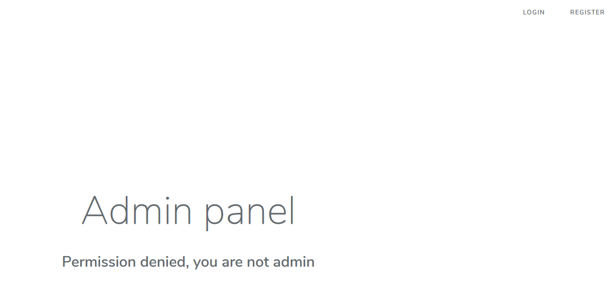
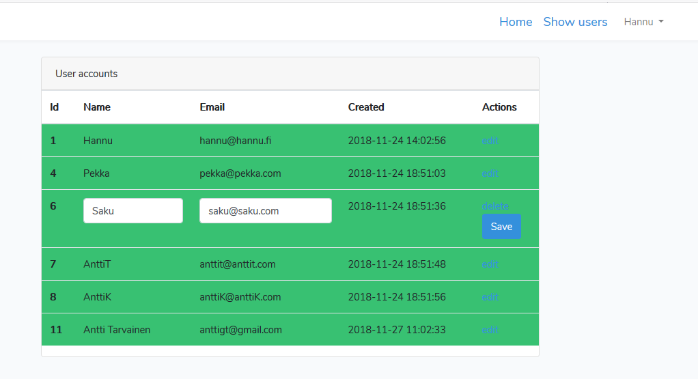
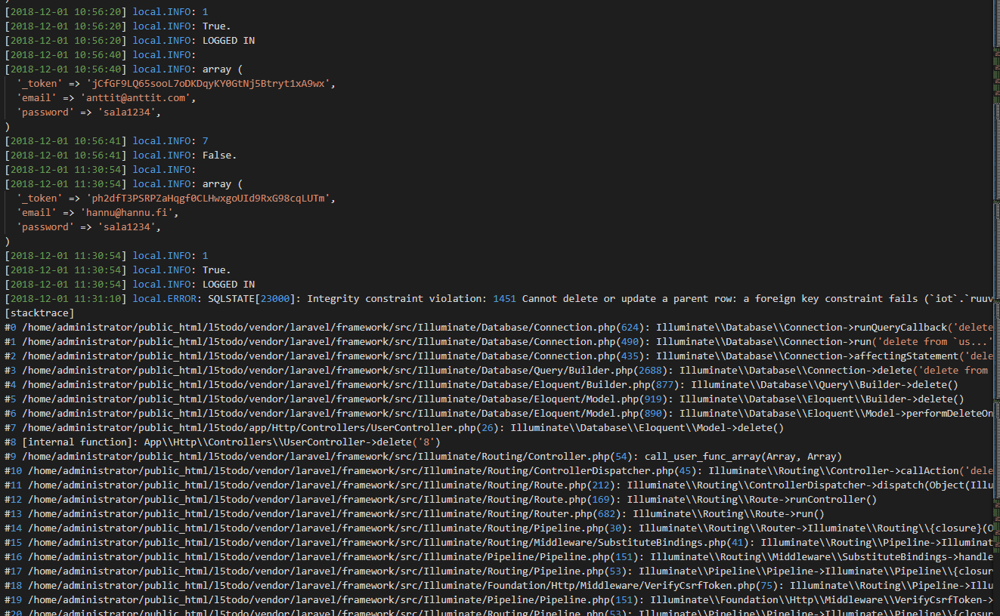

# Admin Panel

## Johdanto
Tarkoituksena oli tehdä projektiin oma admin paneeli, mistä voidaan muokata MySQL-tietokantaa käyttäjien kohdalta. Toimintoja käyttöliittymässä olisi käyttäjän tietojen hakeminen, muokkaaminen ja poistaminen.

## Admin paneeliin kirjautuminen
Admin paneeli sivustolle pääsee sisälle, kun kirjaudutaan käyttäjätunnuksilla, joiden id löytyy admins taulusta. Jos id:tä ei löydy, sivusto ilmoittaa siitä käyttäjälle ohjaamalla näkymään, mikä kertoo, että pääsy on evätty, koska et ole admin.

## Admin näkymä
Tässä on kuva admin panelin muokkaus näkymästä.

Edit linkki hakee uuden näkymän laravelista, mikä määriytyy painetun sarakkeen käyttäjän id:n mukaan. Tällöin muokattavien kenttien kentät muuttuvat input elementeiksi, jolloin päästään muokkaamaan tietoja. Save napin kuuluisi lähettää form POST methodia käyttäen, mutta emme saaneet nappia toimimaan. Sivustoa emme saaneet mitenkään reagoimaan Save napin painalluksella, eli formin tiedot ei lähteneet liikkeelle. Delete linkki puolestaan poistaa koko käyttäjän tiedot tietokannasta.

## Laravelin debuggaus logeista
Ongelmien ratkomiseen käytimme laraverin debuggaus logeja, josta voitiin seurata mitä parametreissa kulkee tietttyjen toimintojen tapahtuessa. Oheessa kuva debuglogista, kuva ilmoittaa virheestä käyttäjän poistamisesta, jolla on tieto välitaulun kautta tietokannasta. 
## Toteuttamatta jääneet toiminnot

Käyttäjien tietojen tallentaminen. Deletoinnin toimiminen kaikkien käyttäjien kohdalla.

## Kohdatut ongelmat

Formin toiminta laravelissa. Mystisen virheen takia, emme saaneet toimimaan laravelin formin POST methodia ollenkaan. Laravelin omat ohjeet eivätkä muut netistä löytyneet lähteet ratkaisseet ongelmaa. Kokeilimme harjoitustöiden toimivia formeja, mutta nekään eivät toimineet jostain syystä laravel ympäristössämme. Uusissa laravel versioissa illuminate/html ei ole enää vakiona ja sen käyttöön otto ei onnistunut, sillä se vaati erillisen pakettejan asentamista ja konfigurointia, mitä emme saaneet toimimiaan.

Käyttäjän poistaminen ei toimi kaikkien kohdalla, sillä osa tiedoista tulee välitaulun kautta. Ongelma huomattiin vasta dokumentointi vaiheessa, eikä ollut aikaa enää korjata sitä. Ongelma olisi ollut korjattavissa kun koodissa huomioitaisiin välitaulu, mistä osa tunnuksista saa id tietoja.
