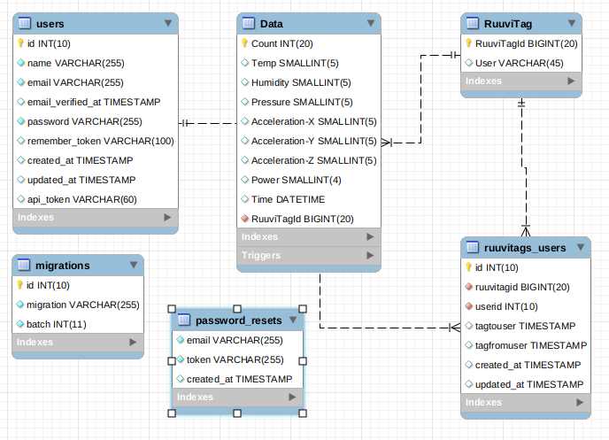

# Web-palvelinohjelmointi TTMS0900 –opintojakson harjoitustyö

## Rest-rajapinta Laravel-sovelluskehyksellä

### [Hannu Oksman L2912](https://github.com/szeretni), [Joose Seppälä M3579](https://github.com/jooseba), [Antti Tarvainen L4623](https://github.com/atarvainen)

## Johdanto

Saimme idean tähän harjoitustyöhön IoT-järjestelmän toteutus –opintojaksosta, joka tarvitsi oman taustaohjelmiston datan käyttöä varten. Lyhyesti sanottuna toteutimme IoT-ratkaisun, jossa RuuviTag-sensoreiden lähettämää dataa vastaanotetaan Raspberry Pi –tietokoneella Bluetooth-yhteyden avulla. Raspberry Pi käsittelee dataa ja julkaisee sen MQTT-protokollalla JSON-muodossa. Labranetissä oleva virtuaalikone tilaa MQTT-otsikkoa ja tallentaa datan MySQL-tietokantaan. [IoT-toteutuksen dokumentaatio (ei ajantasalla).](https://github.com/atarvainen/IoT_Project)

Representational State Transfer (REST) on HTTP-protokollaan perustuva arkkitehtuurimalli ohjelmointirajapintojen toteuttamiseen (Rantala 2018). Käytämme PHP-kielen Laravel-sovelluskehystä rajapinnan toteuttamiseen. Rajapinnat ovat tyypillisiä REST-resursseja, jotka käyttävät HTTP-metoda GET, PUT, POST ja DELETE. Olemme toteuttaneet React-ohjelman, joka hyödyntää rajapinnoista haettavaa mittausdataa, käyttäjätietoja ja sensoritietoja. [React-toteutuksen dokumentaatio.](https://github.com/atarvainen/reactIoTproject/tree/master/react)

Saimme toteutettua toimivan kokonaisuuden, joka on kohtuullisen monipuolinen. Käytämmä mm. osassa rajapintoja api_token –avainta, jolla rajoitetaan ketkä saavat pyyntöihin vastauksen. Ongelmia oli erittäin paljon ja emme käyttäneet tuntikirjanpitoa, joten emme tarkkaan kykene osoittamaan, kuinka paljon olemme käyttäneet aikaa eri haasteisiin. Lähdekoodit ovat tässä kansiossa ja ohjelma pyörii Labranet:ssa olevalla virtuaalikoneella (IP-osoite: 192.168.9.133).

### Tietokantakuvaus

Osa tauluista tehtiin ennen kuin Laravel-projekti alkoi ja osa tauluista on tehty php artisan make:migration -toiminnallisuudella. Meidän tekemät migrate-tiedostot ovat [/database/migrations](https://github.com/atarvainen/reactIoTproject/tree/master/laravel/database/migrations)-kansiossa ja ne on ajettu tietokantaan php artisan migrate:lla. 

### Rajapintakuvaukset

[Rajapintakuvauksia (ei ole kirjoitettu kaikista resursseista)](../laravel/interfacedescription.md)

Suurin osa reiteistä ovat api.php:ssa ja osa niistä vaatii api_token:n käyttöä. /api/-resurssit on tarkoitettu toisten ohjelmien, kuten React, käytettäväksi. web.php:ssa on Laravel:n admin-paneelin käyttämät reitit ja ne vaativat kirjautumisen, mutteivät api_token.

#### Advanced Rest Client:lla lähetetty pyyntö POST /api/login -rajapintaan

POST-pyynnöissä parametreja välitetään kutsun sisällä ("Body", vrt. osoiterivimuuttujat ("string queries" esim. url?sum=1+1)) JSON-muodossa. 

#### Vastaus

Rajapinta palauttaa käyttäjätiedot, api_token -avaimen sekä käyttäjälle osoitetut RuuviTag-sensorien tiedot.

## Lista tiedostoista, joita olemme kommentoineet

* /app/Admin.php
* /app/Data.php
* /app/Ruuvitag.php
* /app/RuuvitagsUser.php
* /app/User.php
* /app/Exceptions/Handler.php
* /app/Http/Kernel.php
* /app/Http/Controllers/DataController.php
* /app/Http/Controllers/RuuvitagController.php
* /app/Http/Controllers/UserController.php
* /app/Http/Controllers/Auth/LoginController.php
* /app/Http/Controllers/Auth/RegisterController.php
* /app/Http/Middleware/Authenticate.php
* /app/Http/Middleware/CORS.php
* /app/Http/Requests/AdminTools.php
* /routes/api.php

## Toteuttamatta jääneet ominaisuudet

* Admin-panel, josta voisi lisätä ja poistaa Ruuvitag-sensoreita sekä käyttäjiä.
* Käyttäjät eivät voi asettaa itselleen tai poistaa itseltään Ruuvitag-sensoreita

## Kohdattuja ongelmia

* CORS
* Labranetin virtuaalikoneella liian vähän resursseja. Kaikki kyselyt eivät toimineet, poistettu 30.11. 150000 riviä Data-taulusta
* Mixed Content kun Laravel Labranetin virtuaalikoneella ja React Studentilla. Korjattu ottamalla virtuaalikoneella käyttöön itse allekirjoitettu sertifikaatti, jolloin saatu https käyttöön. Aikaisemmin ei ongelma kun Student oli http.

