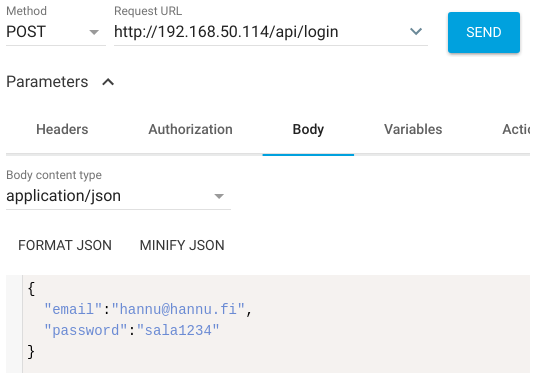
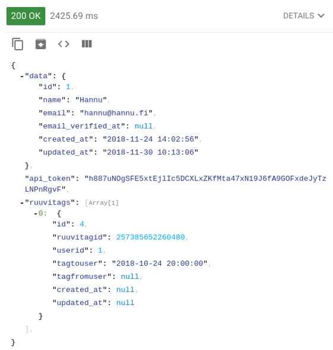

# Web-palvelinohjelmointi TTMS0900 –opintojakson harjoitustyö

## Rest-rajapinta Laravel-sovelluskehyksellä

### [Hannu Oksman L2912](https://github.com/szeretni), [Joose Seppälä M3579](https://github.com/jooseba), [Antti Tarvainen L4623](https://github.com/atarvainen)

## Johdanto

Saimme idean tähän harjoitustyöhön IoT-järjestelmän toteutus –opintojaksosta, joka tarvitsi oman taustaohjelmiston datan käyttöä varten. Lyhyesti sanottuna toteutimme IoT-ratkaisun, jossa RuuviTag-sensoreiden lähettämää dataa vastaanotetaan Raspberry Pi –tietokoneella Bluetooth-yhteyden avulla. Raspberry Pi käsittelee dataa ja julkaisee sen MQTT-protokollalla JSON-muodossa. Labranetissä oleva virtuaalikone tilaa MQTT-otsikkoa ja tallentaa datan MySQL-tietokantaan.

Representational State Transfer (REST) on HTTP-protokollaan perustuva arkkitehtuurimalli ohjelmointirajapintojen toteuttamiseen (Rantala 2018). Käytämme PHP-kielen Laravel-sovelluskehystä rajapinnan toteuttamiseen. Rajapinnat ovat tyypillisiä REST-resursseja, jotka käyttävät HTTP-metoda GET, PUT, POST ja DELETE. Olemme toteuttaneet React-ohjelman, joka hyödyntää rajapinnoista haettavaa mittausdataa, käyttäjätietoja ja sensoritietoja.

Saimme toteutettua toimivan kokonaisuuden, joka on kohtuullisen monipuolinen. Käytämmä mm. osassa rajapintoja api_token –avainta, jolla rajoitetaan ketkä saavat pyyntöihin vastauksen. Ongelmia oli erittäin paljon ja emme käyttäneet tuntikirjanpitoa, joten emme tarkkaan kykene osoittamaan, kuinka paljon olemme käyttäneet aikaa eri haasteisiin. Lähdekoodit ovat saatavilla Laravel-projektin [GitHub-repositoriosta](https://github.com/atarvainen/reactIoTproject/tree/master/laravel) ja ohjelma pyörii Labranet:ssa olevalla virtuaalikoneella (IP-osoite: 192.168.9.133).

### Rajapintakuvaukset

[Rajapintakuvauksia ei ole kirjoitettu kaikista resursseista](../laravel/interfacedescription)

### Advanced Rest Client:lla otettuja kuvakaappauksia POST /api/login -rajapintaan lähetetystä pyynnöstä ja vastauksesta

### Vastaus

